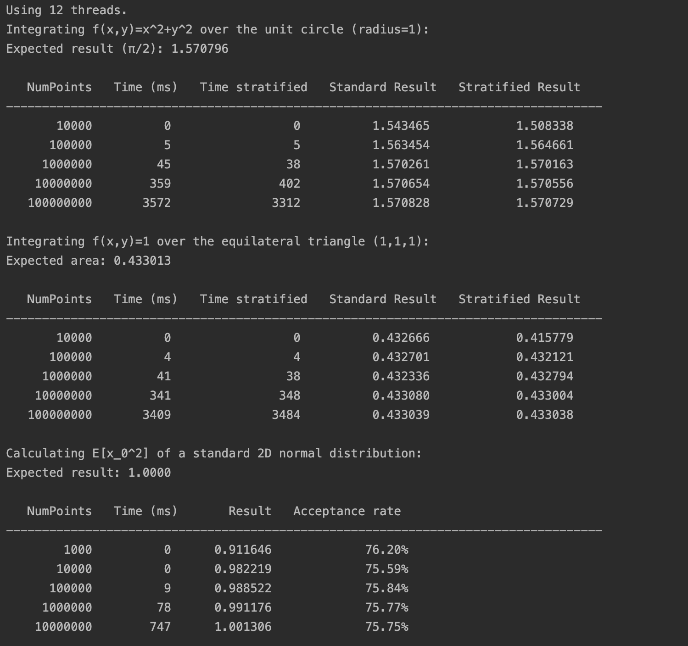

# Monte Carlo Integration

This project demonstrates parallel numerical integration of functions over various geometric domains using Monte Carlo
methods. It includes implementations of standard Monte Carlo integration, stratified sampling, and Metropolis-Hastings
sampling.

## Understanding Monte Carlo Integration

Monte Carlo integration is a technique for approximating integrals by using random samples. Instead of analytically
computing the integral, we estimate it by drawing random points uniformly from the domain and evaluating the integrand
at these points. As the number of samples increases, the approximation typically converges to the true value of the
integral.

The basic formula for Monte Carlo integration is:

$$\int_{\Omega} f(x)\ dx \simeq \frac{|\Omega|}{n} \sum_{i=0}^{n-1} f(x_i)$$

- $\Omega$ is the domain over which we integrate.
- $f(x)$ is the function to be integrated.
- $|\Omega|$ denotes the measure (volume, area, length) of the domain.
- $x_i$ are points sampled uniformly at random from $\Omega$.
- $n$ is the number of sample points.

The accuracy of the Monte Carlo approximation improves with the number of samples, and various variance-reduction
techniques (such as stratified sampling) can be applied.

## Sampling Methods

### Standard Monte Carlo (Uniform Sampling)

In standard Monte Carlo integration, we:

1. Determine a bounding region that contains the entire domain $\Omega$.
2. Draw points uniformly at random from this bounding region.
3. Evaluate $f$ at each point. If a point falls outside $\Omega$, its contribution is zero.
4. Average these values and multiply by the measure of the bounding region.

This approach is straightforward but may have high variance, especially if $\Omega$ is complex or if $f$ varies
significantly within the domain. Uniform sampling does not focus on any particular region of the domain and treats all
areas equally, which can lead to inefficient sampling, particularly in higher dimensions or for irregular shapes.

### Stratified Sampling

Stratified sampling reduces variance by partitioning the bounding region into smaller, non-overlapping subregions
(strata) and sampling from each one. By ensuring that every stratum is represented in the sample set, this method:

1. Provides a more uniform coverage of the domain.
2. Reduces the likelihood of clustering samples in just a few areas.
3. Improves the accuracy of the integral estimate with fewer samples compared to plain uniform sampling.

In practice, you divide each dimension into several intervals to form a grid of strata. For each stratum, you then take
multiple random points. The result is then a weighted average of all strata. Since each subregion is sampled, the
overall estimate tends to have lower variance, making stratified sampling more efficient and often more accurate for
the same number of samples.

### Metropolis-Hastings (MCMC)

Metropolis-Hastings algorithm for sampling from a complex probability distribution $p(x)$
and computing expectations $E[h(x)]$ with respect to this distribution.

How does it work:

- choose a starting point $x_0$
- define a proposal distribution $Q(x'|x)$ (here: Gaussian is centered at current point)
- generate new candidate point $x'$ from $Q(x'|x)$
- compute acceptance ratio $r = p(x')/p(x)$
- accept $x'$ with probability $min(1,r)$
- for accepted points, accumulate $h(x)$ to compute $E[h(x)]$
- repeat

The algorithm will generate samples distributed according to $p(x)$,
which lets us compute $E[h(x)]$ = $\int h(x)p(x)dx / \int p(x)dx$.

To parallelize: run multiple independent chains and average their results.

## Features

- **Parallel Implementation**:
    - The integration process is parallelized by splitting the total number of samples across multiple threads.
    - Each thread independently generates and evaluates its own subset of points and accumulates partial sums.
    - After all threads finish, their partial sums are combined (reduced) to produce the final integral estimate. This
      uses multiple threads to speed up the computation.
    - Each thread has its own local generator, which are seeded with `std::seed_seq`, which itself is created with
      random values from `std::random_device`:

```c++
    // Initializes pseudo-random engines with seeds from std::seed_seq
    void initializeEngines(size_t numThreads) {
        std::random_device rd;
        std::vector<std::uint32_t> entropy;
        entropy.reserve(numThreads);

        for (size_t i = 0; i < numThreads; ++i) {
            entropy.push_back(rd());
        }

        std::seed_seq seq(entropy.begin(), entropy.end());
        std::vector<std::uint32_t> seeds(numThreads);
        seq.generate(seeds.begin(), seeds.end());

        engines.clear();
        for (auto seed: seeds) {
            engines.emplace_back(seed);
        }
    }
```

- **Multiple Integration Domains**:
    - **Hypersphere**: A hypersphere of arbitrary dimension and radius, bounded by a hypercube.
    - **Polygon2D**: A polygon in 2D, defined by a set of vertices.
    - **Polytope** (H-form): A convex polytope defined by linear inequalities ($Ax ≤ b$) and an explicit bounding box.

## Directory Structure

- **`domain/`**: Contains classes representing geometric domains (`Hypersphere`, `Polygon2D`, `Polytope`) and the
  `IntegrationDomain` interface they all implement.
- **`integrators/`**: Contains an abstract `AbstractIntegrator` which handles parallel random number generation and also
   the integration strategies: `MonteCarloIntegrator` for standard and stratified sampling, and
  `MetropolisHastingsIntegrator` for MH-sampling.
- **`main.cpp`**: Demonstrates integrating different functions over different domains.

## Dependencies

- **C++17** or later:
- **CMake**: For building the project.
- **Eigen**: A C++ template library for linear algebra.

## Building and running the project

1. Ensure you have CMake and C++17 or newer installed.
2. Clone the repository:
   ```bash
   git clone git@github.com:AMSC-24-25/09-mc-09-mc.git
   mv 09-mc-09-mc 09-mc
   cd 09-mc
   ```
3. Create a build directory and run CMake:
   ```bash
    mkdir build && cd build
    cmake ..
    make
   ```
4. Run:
    ```bash
    ./09-mc
    ```

The program shows:

- Integrating `f(x,y) = x² + y²` over a unit circle, displaying results from standard and stratified sampling 
  for various numbers of points.
- Integrating `f(x,y) = 1` over an equilateral triangle (using `Polygon2D`) to find its area 
  and print a similar comparison table.
- Calculates $E[x^2]$ of a standard 2D normal distribution using Metropolis-Hastings method of random chains.



## Possible Improvements

- **Physics application**: Show a real-life physics scenario where monte-carlo integration can be used.
- **Advanced domains**: Add more complex domains or integrate with convex polytope libraries.
- **Variance Reduction**: Enhance stratification or add Latin hypercube sampling for even better variance reduction.
